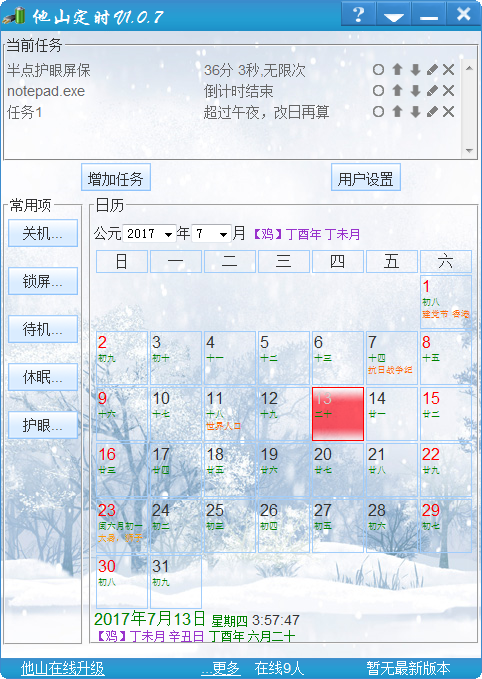

# OHUI
Other Hill Gui Development Framework, abbreviation OHUI,embedding Gecko 52.0，developers can write html on ff52.0,then load it with OHUI.support all the same display effection as  ff52.0，include xul,html(5),css(3),js,flash,  support js vs c++ call each other, for the limition of html5 and css3, you can refer firefox52.0.

OHUI support firefox plugins，Flash display(need extra 10MB space, for flash plugins 23.0), no support firefox extension now.
Demo (support flash23.0) download(23MB)：http://oltag.com:8080/yaolixing/18/10/07/他山界面演示v22.0_flash.rar

taobao：https://shop447901425.taobao.com/category-1326228892.htm

ＱＱ group：  264695584 (QQ group for technology support on firefox embedding development)
Demo download(13MB)：http://oltag.com:8080/yaolixing/18/10/07/他山界面演示v22.0.rar
Demo source be send by email, after order it, please remain email for receive demo source.

latest progress: http://yaolixing.oltag.com/gn-A65A3AD3-97A4-4A3B-AFEB-EF4F36C814CC.html

csdn blog:http://blog.csdn.net/otherhill/article/details/73696611

163 blog:http://yaolixing01.blog.163.com/blog/static/6674173320171473748180/

OHUI develop under visual studio 2010, ultimate package size is 13MB. not rely on other  UI library. use windows sdk only，can embed into other project ,e.g.  QT,MFC,WxWidget project.
the url  on cfg.ini, is  full html path which will be loaded.  for Chinese path, please use escape encode, or copy it from browser's address directly. You can use http://, https://, file:///, to load html file.default url is ./webui/index.html 

OHUI V52 Demo for Linux 
Support libc-2.12，gtk+-3.0 3.4.4 and Linux x64， package all kinds of .so dependence，
under most Linux x86_64，run  directly after unzip it
http://oltag.com:8080/yaolixing/18/11/00/v52/ffv52_libc2.12_20180523.tar.gz (100MB)

他山界面演示v22.0.rar(13MB):
http://oltag.com:8080/yaolixing/18/10/07/他山界面演示v22.0.rar

他山界面演示v22.0_flash.rar(23MB)
http://oltag.com:8080/yaolixing/18/10/07/他山界面演示v22.0_flash.rar

https://groups.google.com/d/forum/other-hill-gui

http://bbs.oltag.com or http://bbs.otherhill.com (now no arrived)

compile firefox v52,you can visit 
https://developer.mozilla.org/en-US/docs/Mozilla/Developer_guide/Build_Instructions/Simple_Firefox_build

